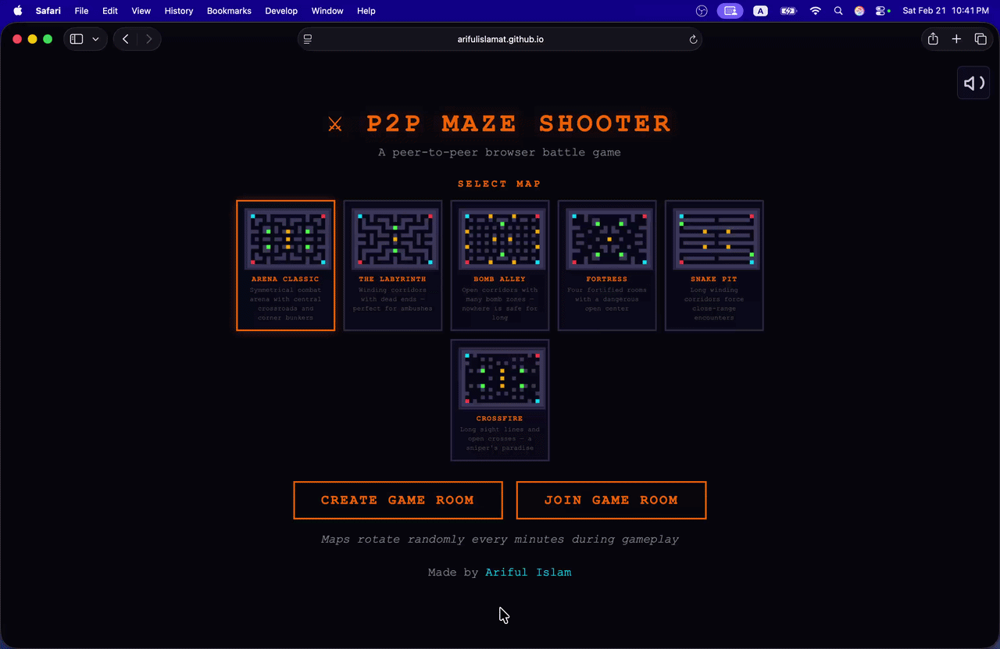

# ⚔ P2P Maze Shooter

A real-time peer-to-peer multiplayer shooter built entirely with **vanilla JavaScript** — no frameworks, no build tools, no server. Just open `index.html` and play.

> Two players battle across 6 rotating maze arenas, dodging bombs and zombies, in a retro-neon browser game powered by WebRTC.

<div align="center">

<a href="https://arifulislamat.github.io/p2p-maze-shooter/" target="_blank" rel="noopener noreferrer">
  
</a>


</div>

<div align="center">
  
</div>

## Features

- **Peer-to-peer multiplayer** — Direct browser-to-browser via WebRTC (PeerJS). No game server needed.
- **Host-authoritative networking** — Host runs physics, broadcasts state; guest sends only inputs. The guest acts as a "dumb terminal": it applies host-sent positions and state directly, with no client-side prediction or interpolation. Cheat-resistant by design.
- **6 unique maze arenas** — Each with distinct layouts: Arena Classic, The Labyrinth, Bomb Alley, Fortress, Snake Pit, Crossfire.
- **Automatic map rotation** — Maps shuffle and rotate every 60 seconds. After 6 maps (6 min), highest score wins.
- **Dynamic hazards** — Bombs spawn randomly with a heartbeat fuse animation and area-of-effect blast. Zombies roam the maze and freeze you on contact.
- **Power-ups** — Health packs, speed boosts, and weapon pickups (rapid-fire, scatter-shot) spawn on the battlefield.
- **4 built-in themes** — Retro Neon, Midnight Void, Sandstorm, and Cyber Sakura. Switch themes from the settings panel. [Create your own](docs/adding-themes.md) with zero engine changes.
- **Zero build step** — Pure HTML/CSS/JS. No bundler, no transpiler, no `npm install`. Clone and open.

## Quick Start

### Play Online

🎮 **No setup needed** — just open the game in your browser and share a room code with a friend:

👉 **[https://arifulislamat.github.io/p2p-maze-shooter/](https://arifulislamat.github.io/p2p-maze-shooter/)**

### Run Locally

```bash
# Clone the repo
git clone https://github.com/arifulislamat/p2p-maze-shooter.git
cd p2p-maze-shooter

# Serve locally (any static server works)
cd src && npx serve .
# or
cd src && python3 -m http.server 8000
```

Then open `http://localhost:8000` in your browser.

> **Note:** You can also open `index.html` directly in a browser (`file://`), but WebRTC connectivity works best when served over HTTP/HTTPS.

### Browser Support

| Browser  | Status       | Notes |
| -------- | ------------ | ----- |
| Chrome   | ✅ Supported |       |
| Edge     | ✅ Supported |       |
| Brave    | ✅ Supported |       |
| Firefox. | ✅ Supported |       |
| Safari   | ✅ Supported |       |

#### Local Network Play (Same Wi-Fi, Different Devices)

**Note:** The mDNS (local IP obfuscation) issue only affects desktop browsers. Mobile browsers (iOS/Android) do **not** use mDNS and do not require any changes for local network play.

If you and your opponent are on the **same local network** (e.g., same Wi-Fi) **on desktop**, browsers hide real local IP addresses by default using mDNS obfuscation — a privacy feature that can prevent WebRTC from establishing a direct connection.

**You only need to change this setting if you are playing on the same local network on desktop and the connection is failing.**

<details>
<summary><strong>Firefox</strong></summary>

1. Open a new tab and go to `about:config`
2. Accept the risk warning if prompted
3. Search for `media.peerconnection.ice.obfuscate_host_addresses`
4. Set it to **`false`**
5. Reload the game page

</details>

<details>
<summary><strong>Chrome</strong></summary>

1. Open a new tab and go to `chrome://flags/#enable-webrtc-hide-local-ips-with-mdns`
2. Set **"Anonymize local IPs exposed by WebRTC"** to **Disabled**
3. Click **Relaunch** to restart Chrome
4. Reload the game page

</details>

<details>
<summary><strong>Brave</strong></summary>

1. Open a new tab and go to `brave://flags/#enable-webrtc-hide-local-ips-with-mdns`
2. Set **"Anonymize local IPs exposed by WebRTC"** to **Disabled**
3. Click **Relaunch** to restart Brave
4. Reload the game page

</details>

<details>
<summary><strong>Edge</strong></summary>

1. Open a new tab and go to `edge://flags/#enable-webrtc-hide-local-ips-with-mdns`
2. Set **"Anonymize local IPs exposed by WebRTC"** to **Disabled**
3. Click **Relaunch** to restart Edge
4. Reload the game page

</details>

> Playing across **different networks** (e.g., home vs. office) works out of the box in all browsers with no changes needed.

### How to Play

1. **Create a game** → Click "CREATE GAME ROOM" to host. Share the invite link.
2. **Join a game** → Paste the room code or use the invite link.
3. **Controls** → `W A S D` to move, `Space` to shoot, `R` to restart.

## Architecture

```
index.html              Entry point + lobby UI
├── themes/
│   ├── retro-neon.js   Built-in theme: Retro Neon (default reference)
│   ├── midnight-void.js
│   ├── sandstorm.js
│   ├── cyber-sakura.js
│   └── index.js        Theme registry
├── core/
│   └── ThemeManager.js Runtime theme switcher
├── constants.js        Game config, maze data, parseMaze()
├── sound.js            Procedural audio (Web Audio API, zero files)
├── physics.js          Collision detection (AABB)
├── renderer.js         Canvas rendering, HUD, effects
├── network.js          PeerJS wrapper, room codes, connection lifecycle
├── game.js             Game loop, state machine, input, networking
└── styles.css          Lobby + HUD styles
```

All modules use the **IIFE pattern** (Immediately Invoked Function Expression) to avoid polluting the global scope.

### Data Flow

```
Host                              Guest
┌──────────┐   WebRTC (PeerJS)   ┌──────────┐
│ Input    │◄───── inputs ───────│ Input    │
│ Physics  │                     │          │
│ Game Loop│─── state & corr. ──►│ Renderer │
│ Renderer │                     │          │
└──────────┘                     └──────────┘
```

The **host** runs the authoritative simulation (physics, collisions, spawning) and broadcasts player positions and state at 60 Hz, with full corrections (health, scores, bombs, zombies, etc.) at 10 Hz. The **guest** sends only input deltas and applies received state directly for rendering—no prediction or interpolation. All time-based events (explosions, zombies) are synchronized using elapsed time, not raw timestamps, for robust, clock-skew-proof gameplay.

**Guest rendering always runs at 60 Hz** for smooth visuals, regardless of network correction rate.

## Technical Notes

- The guest is a "dumb terminal": it applies host-sent positions and state directly, with no client-side prediction or interpolation.
- Host sends player positions and state at 60 Hz, and full corrections at 10 Hz.
- All time-based events (explosions, zombies) are synchronized using elapsed time, not raw timestamps, to avoid clock skew and animation bugs.
- Guest rendering always runs at 60 Hz for smooth gameplay.

## Game Rules

| Rule               | Detail                                                                |
| ------------------ | --------------------------------------------------------------------- |
| **Match duration** | 6 maps × 1 min = 6 minutes total                                      |
| **Instant win**    | First to 8 kills wins immediately                                     |
| **Timeout win**    | After 6 minutes, highest kill count wins                              |
| **Tiebreaker**     | If kills are equal, higher health wins; otherwise it's a draw         |
| **Respawn**        | 3-second respawn timer after death                                    |
| **Bombs**          | Spawn dynamically (cap ramps 3→4), heartbeat fuse, area blast damage  |
| **Zombies**        | Roam the maze, freeze players for 3 seconds on contact                |
| **Health packs**   | Spawn periodically, restore 3 HP on pickup                            |
| **Speed boosts**   | 4-second 1.6× speed multiplier                                       |
| **Weapon pickups** | Rapid-fire (faster shots) or scatter (3-bullet spread) for 5 seconds  |

## Tech Stack

| Layer       | Technology                                     |
| ----------- | ---------------------------------------------- |
| Language    | Vanilla JavaScript (ES6+)                      |
| Rendering   | HTML5 Canvas 2D                                |
| Networking  | WebRTC via [PeerJS](https://peerjs.com/) (CDN) |
| Styling     | Vanilla CSS with CSS variables                 |
| Build tools | None — zero dependencies                       |

## Documentation

| Guide | Description |
|---|---|
| [Architecture](docs/architecture.md) | File structure, game loop, state machine, networking model |
| [Adding Themes](docs/adding-themes.md) | Step-by-step guide to creating a new visual theme |
| [Adding Maps](docs/adding-maps.md) | How to add a new maze arena |
| [Config Tuning](docs/config-tuning.md) | Every gameplay constant explained |
| [Networking](docs/networking.md) | P2P protocol, message types, reconnection |

## Contributing

Contributions are welcome! See [CONTRIBUTING.md](CONTRIBUTING.md) for guidelines.

## License

[MIT](LICENSE) © [Ariful Islam](https://arifulislamat.com)
